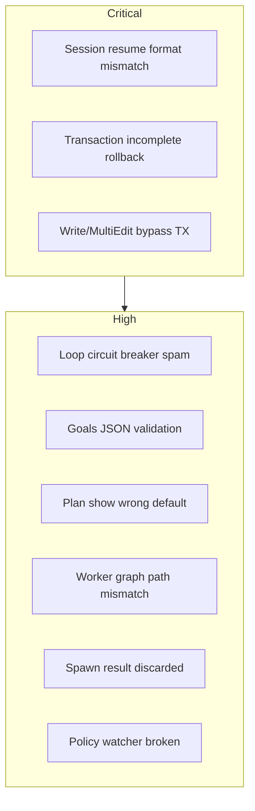

# Bimax Bug Report

Static review of recently modified code (`src/core/`, `src/cli/`, `src/tools/`, `src/memory/`), plus a TypeScript build and Jest run.

**Build:** passes (`tsc`)  
**Tests:** 442 passed / 13 failed across 5 suites — failures are sandbox/environmental (`git init` hooks, `sandbox-exec`, `EMFILE`), not application logic failures in the reviewed code.

---

## Critical (3)

### 1. Session resume injects UI transcript, not LLM history

**Files:** `src/cli/session.ts`, `src/cli/screens/FullScreen.tsx`, `src/cli/commands/session.ts`

Sessions persist `MessageEntry` objects (UI format: `id`, `timestamp`, `toolCalls`). On `/resume` or `/branch`, those entries are assigned directly to `persona.messages`, which the agent loop sends to the LLM as `Message[]`.

```996:1009:src/cli/screens/FullScreen.tsx
          restoreMessages: (msgs: any[]) => {
            // ...
            const activePersona = personasRef.current?.[defaultAgent] || personasRef.current?.bimax;
            if (activePersona) activePersona.messages = msgs.filter((m: any) => m.role !== 'system');
          },
```

**Problem:** LLM history needs `role: 'tool'` messages and `tool_calls` on assistant turns. Sessions only store collapsed UI messages (`toolCalls`, not `tool_calls`). Tool-result exchanges are never persisted separately.

**Impact:** Resuming a tool-heavy session loses tool context, can produce malformed API payloads, or cause provider errors.

---

### 2. Transaction auto-rollback only on “oldString not found”

**File:** `src/tools/implementations/edit.tool.ts`

Auto-rollback runs only when fuzzy match fails. After `trackEdit()` succeeds, failures from `fs.writeFile`, corrupt-write refusal, blast-radius cancel, or user rejection leave prior edits committed with no rollback.

```230:233:src/tools/implementations/edit.tool.ts
        if (globalTransactionManager.isOpen()) {
          const rbMsg = await globalTransactionManager.autoRollback(args.path, 'oldString not found');
          return rbMsg ? `${msg}\n\n${rbMsg}` : msg;
        }
```

```270:274:src/tools/implementations/edit.tool.ts
    await globalTransactionManager.trackEdit(fullPath);
    await backupFile(fullPath);
    await fs.writeFile(fullPath, updated, 'utf8');
```

**Impact:** `/tx begin` does not provide true atomicity for multi-file edits.

---

### 3. WriteFileTool / MultiEditTool bypass transactions

**Files:** `src/tools/implementations/file.tool.ts`, `src/tools/implementations/multiedit.tool.ts`

Only `EditFileTool` calls `globalTransactionManager.trackEdit()`. The `/tx` command docs say all file edits are tracked; writes and multi-edits are not.

**Impact:** `/tx rollback` silently misses write/multi-edit changes.

---

## High (6)

### 4. Loop detector circuit breaker fires on every call after threshold

**File:** `src/core/loop-detector.ts`

Once `totalCalls >= 200`, every subsequent `record()` returns a hard `circuit_breaker` signal with no latch or one-shot behavior.

```51:60:src/core/loop-detector.ts
    if (this.totalCalls >= MAX_TOTAL_CALLS) {
      return {
        type: 'circuit_breaker',
        // ...
        severity: 'hard',
      };
    }
```

**Impact:** Long tasks spam `[LOOP DETECTED — HARD STOP]` interventions into message history on calls 200, 201, 202, …

---

### 5. Corrupt `goals.json` crashes GoalManager

**File:** `src/memory/goal.manager.ts`

`JSON.parse` result is used without validating it is an array. A file containing `{}`, `"string"`, or `null` passes the try/catch but throws on `.filter()` / `.find()`.

```51:58:src/memory/goal.manager.ts
    try {
      const raw = await fs.readFile(this.goalsPath, 'utf-8');
      this.goals = JSON.parse(raw);
    } catch {
      this.goals = [];
    }
```

**Impact:** `/goals`, `GoalsTool`, and system-prompt injection can crash the CLI.

---

### 6. `/plan show` “most recent” uses alphabetical order

**Files:** `src/cli/commands/plan.ts`, `src/memory/plan.manager.ts`

Comment says “most recently modified plan”, but `list()` returns slugs sorted alphabetically. `slugs[slugs.length - 1]` is the last alphabetical slug, not the newest file.

**Impact:** Wrong plan shown by default.

---

### 7. Sub-agent workers use a different graph store path

**Files:** `src/cli/worker.entry.ts` vs `src/core/container.ts`

Main process: `<cwd>/.breakglass/graph/playground.json`  
Workers: `~/.breakglass/graph.json`

**Impact:** Sub-agents querying the graph see stale or empty data relative to the parent project.

---

### 8. SpawnSubagentTool discards worker results

**File:** `src/tools/implementations/spawn.tool.ts`

Tool description says “The system notifies you once it completes”, but the `.then/.catch` only logs. The parent agent never receives the sub-agent result in its message history.

**Impact:** Contract mismatch — parent cannot act on sub-agent output.

---

### 9. Policy hot-reload watcher likely never fires

**File:** `src/governor/policy.engine.ts`

Watches `process.cwd()` but compares `filename === '.breakglass/policy.json'`. Directory watches emit bare filenames (e.g. `policy.json`), not nested paths.

**Impact:** Runtime policy changes are not picked up.

---

## Medium (7)

| # | Issue | Location | Impact |
|---|-------|----------|--------|
| 10 | Plan slug collision silently overwrites | `plan.manager.ts:create()` | Two similar titles destroy each other |
| 11 | Compaction epoch incremented even when nothing compacted | `context.manager.ts:compact()` | False “stale compaction” via `checkEpoch()` |
| 12 | `/resume` prefix match can select wrong session | `session.ts:179` | Short prefix like `2026` matches unintended session |
| 13 | `/tx begin` reports errors at success level | `tx.ts:28` | “Already open” shown as success |
| 14 | Recipe sub-recipes: no cycle detection | `recipe.ts:61-65` | Circular YAML → stack overflow |
| 15 | Menu `onSelect` async errors not caught | `InteractiveMenu.tsx:41`, `FullScreen.tsx:1270` | Unhandled rejections from `/sessions` resume etc. |
| 16 | Ping-pong loop detector re-fires every matching cycle | `loop-detector.ts:90-105` | Repeated soft loop warnings with no cooldown |

---

## Low (3)

| # | Issue | Location |
|---|-------|----------|
| 17 | `FreeContextTool` “tool_results” item is a no-op stub | `free-context.tool.ts:67-72` |
| 18 | `AgentLoop` passes `null as any` for governor | `base.persona.ts:234` |
| 19 | `/goals` lacks init guard (unlike `/plan`) | `goals.ts:14` |

---

## Summary by subsystem



| Area | Top issues |
|------|------------|
| **Session continuity** | UI vs LLM message format (#1), prefix matching (#12) |
| **Transactions** | Incomplete rollback (#2), missing tools (#3), wrong success level (#13) |
| **Agent loop** | Circuit-breaker spam (#4), ping-pong repeat (#16) |
| **Memory / goals / plans** | Invalid JSON crash (#5), slug overwrite (#10), wrong “recent” plan (#6) |
| **Sub-agents** | Graph path mismatch (#7), results discarded (#8) |
| **CLI / UI** | Menu error handling (#15), recipe cycles (#14) |

---

## Recommended fix order

1. **Session resume** — persist and restore full LLM `Message[]` (or convert `MessageEntry` → `Message[]` with proper `tool_calls` / `tool` roles).
2. **Transactions** — wrap all write paths; call `autoRollback` on any post-`trackEdit` failure; enroll `WriteFileTool` / `MultiEditTool`.
3. **Loop detector** — latch circuit breaker after first fire; add cooldown for ping-pong.
4. **GoalManager** — validate `Array.isArray(JSON.parse(...))`.
5. **Worker graph path** — pass project graph path from parent to workers.

---

I did not add debug instrumentation because this was a static audit, not a single-bug reproduction. If you want to fix a specific item, say which one and we can instrument and verify with runtime logs before patching.